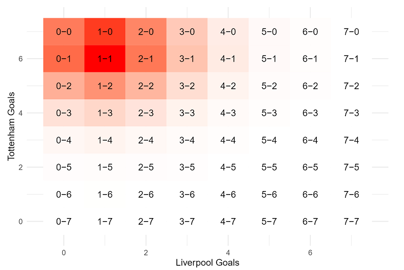

## Overview
The goal of this project is to build a predictive model for simulating the remainder of the 2020-2021 Premier League season as of the end of GameWeek 12. The following report uses an expected goals (xG) model to create relative team ratings based on xG and xGA.

These weights determine a lambda for a Poisson process that is used to predict the number of goals each team will score in a match. Every potential outcome for a match is assigned a probability. The Monte Carlo process samples from the distribution of these match outcomes several times over until an outcome is reached.

To determine the champion, every simulated match result is tabulated and added to the GameWeek 12 premier league standings.

## Data
Beyond the report file, this project contains 4 csv files that are used to help run the code in the RMD file.

understat_all_teams.csv refers to the primary dataset used in the RMD file, containing all relevant xG data from the first 12 GameWeeks of the season. This file was adopted from Vaastav Anand's repository linked [here.](https://github.com/vaastav/Fantasy-Premier-League/tree/master/data/2020-21)

current league standings.csv contains the league standings at the end of GameWeek 12.

remaining fixtures.csv contains the list of fixtures that had not been played as of GameWeek 12.

remaining fixtures tabulated.csv contains the predicted home and away goals of my model for every remaining fixture in the 2020-2021 season.

## Insights

