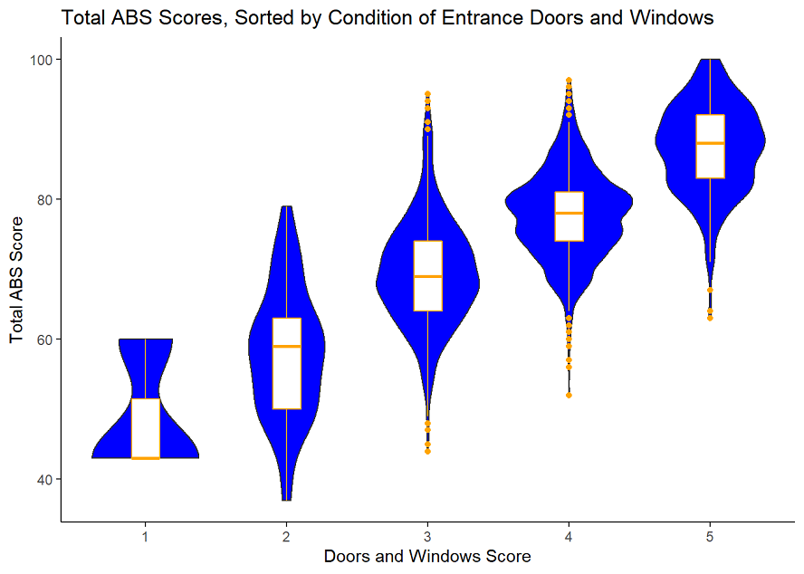

## Overview
This repo contains RMarkdown files of a project that analyzes apartment building scores in Toronto based on lobby features and ratings.

The project was written as a blogpost and is hosted on a Netlify website linked [here.](https://neelansh-visen-sta304-ps1-website.netlify.app/)

## Data
This paper accesses data from the Toronto Open Data Portal (https://open.toronto.ca/). The following assessment uses observation ratings from building audits conducted within the last three years. For each building, several of its physical features and amenities are given a score between 1 and 5, with 5 considered the best. A total building score out of 100 is derived from each individual competent score, and determines whether a full building audit is required.

## Insights
